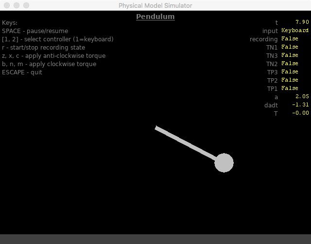

# sim-dynamics
Simulates dynamic physical systems using Box2D and pygame graphics.

A dynamic physical model simulator using pyBox2d within a
self-contained pygame environment for the purpose of
experimenting with dynamic models and dynamic model
controllers.

Two example models are included: a simple pendulum and
a cart-pole system. 

The systems can be influenced manually through keyboard
commands or controlled by a simple controller (PID).

Files contained in the module:
 1. simulator.py - main program file
 2. vars.py - Variable class
 3. data_output.py - class for file output operations
 4. controllers.py - contains a PID controller

Example simulations:
 4. pendulum.py
 5. cart-pole.py

The pyBox2d shape classes are extended with some drawing
code so that they render in pygame.  Adapted from the examples 
in the pybox2d repository:
https://github.com/pybox2d/pybox2d/tree/master/examples/simple
